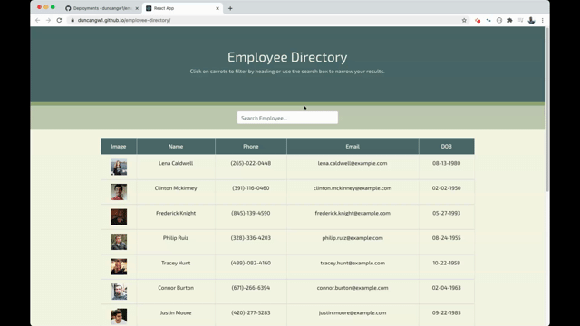

# # 19 React: Employee Directory

# 

## Description

The purpose of the Employee Directory application is to allow an employee or manager to be able to view non-sensitive data about other employees. The Employee Directory was built using React, allowing the structure of the application to be broken up into UI components and allowing for the application to respond to user events (filtering employees by name). Please view the deployed application [here](https://duncangw1.github.io/employee-directory/) or navigate to the [Installation](#installation) section below for instructions on how to run the application locally.

## Table of Contents

- [Installation](#installation)
- [Usage](#usage)
- [License](#licenses)
- [Contributing](#contributing)
- [Tests](#tests)
- [Questions](#questions)

## Installation

_How to install & get the application running._

- Clone the Git SSH Key onto the local machine
- Navigate to the local file in **VS Code** and open the integrated terminal
- Install dependencies using `npm i`
- Invoke the application using `npm start`
- Navigate to **localhost:3000** in a web browser to view the app! (This will open automatically in the default browser after running `npm start`)

## Usage

_Guidelines for usage & application demo._

To use this application you may simply browse the employee table to see the desired information for each employee. You may also type in the search bar to filter the employees by their first name. Please reference the gif below to see a demo of the app in action.

## Licenses

MIT License

Copyright (c) 2020 duncangw1

## Contributing

_Interested in contributing? See the info below._

Contributions are always welcome. If interested, please send an email describing your contribution before submitting a pull request. Pull requests that are opened with a corresponding email will be reviewed as soon as time permits.

## Tests

_No tests are included with this application._

## Questions

_Reach out!_

The best time to reach me is from 8:00am-5:00pm EST, Monday-Friday. All questions will be answered in a timely manner. Emails are preferred.

- Github: [duncangw1](https://github.com/duncangw1)
- Email: duncangw1@gmail.com
